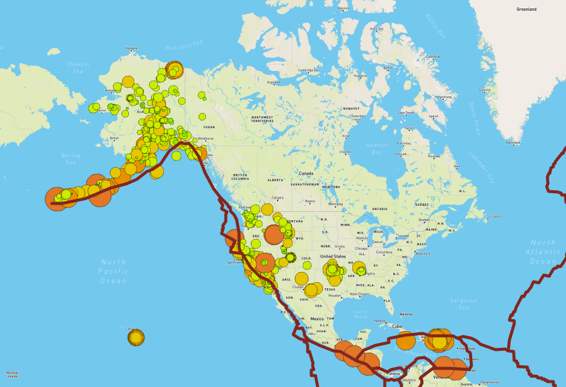

# Mapping_Earthquakes

## Summary
Mapbox files are augmented with Leaflet layers to incorporate three types of GeoJSON data.  
* The data elucidates earthquakes that have taken place in the last seven days by magnitude and location. 
* Tectonic plate boundaries with pop ups that detail the plates interacting at each boundary.
* An additional layer tha can be turned on to explore the plates themselves and names with a pop up that appears on click in any plate space.

An image sample of a portion of the mapped area is provided here:

